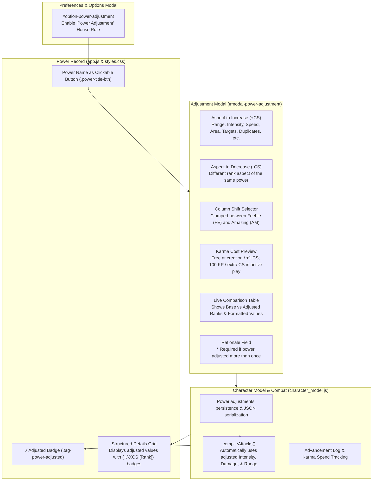

# Walkthrough: Power Adjustment House Rule & System Enhancements

This walkthrough documents the implementation of the optional **Power Adjustment** house rule, allowing heroes to trade rank-based statistics within a single power with balanced Column Shifts, capped at **Amazing (AM)** and **Feeble (FE)**, with full character creation / active play Karma mechanics and in-game explanation enforcement.

---

## 1. Power Adjustment House Rule Overview

### Core Mechanics & Rules
1. **Rank Trade-Off within Same Power**:
   - A player can apply a permanent $+X$ Column Shift (CS) to one rank-based aspect of a power (e.g., Range, Intensity, Duration, Area of Effect, Number of Targets, Flight/Land Speed, Duplicates Created, Designs Memorized, Weight Capacity, Elongation Reach) while applying an equal $-X$ CS to a different aspect of the *same* power.
   - Adjustments cannot be split across multiple powers.
2. **Rank Boundaries**:
   - **Upper Bound**: No aspect can be adjusted above **Amazing (AM)** (capped at 50 in Standard or CMF table).
   - **Lower Bound**: No aspect can drop below **Feeble (FE)** (capped at 2 in Standard or CMF table).
   - Single-aspect powers (e.g. Body Armor, which only possesses Protection intensity) display an informative notice that a secondary rank-based stat is required to shift.
3. **Karma Costs**:
   - **At Character Creation**: All power adjustments are **Free (0 KP)**.
   - **In Active Play**: A $+1 / -1$ CS combo is **Free (0 KP)**.
   - Shifts of more than 1 CS cost **100 KP per extra column shifted** ($2\text{ CS} = 100\text{ KP}$, $3\text{ CS} = 200\text{ KP}$, $N\text{ CS} = (N - 1) \times 100\text{ KP}$).
   - Costs are deducted from available Karma with an advancement log entry: `Power Adjustment: [Power Name] (+XCS [Aspect A] / -XCS [Aspect B])`.
4. **Re-Adjustment & In-Game Rationale**:
   - Adjustments are permanent modifications to the power record unless adjusted again or reset.
   - Adjusting the same power more than once strictly requires an in-game explanation (e.g., intensive training, mutation evolution, cybernetic tuning) entered in the Rationale field.
   - Complete adjustment history is preserved on the power object (`power.adjustments.history`).
   - A **Reset to Base** button allows restoring base stats (Karma spent is not refunded per TSR advancement rules).
5. **Combat Integration**:
   - `compileAttacks()` immediately reflects adjusted Intensity and Range in attack entries, including adjusted damage values, ranges, and `[Adjusted]` tag labels.

---

## 2. Changes Made Across Codebase

| File | Changes & Enhancements |
|---|---|
| [`index.html`](file:///C:/Users/admin/.gemini/antigravity/brain/90637841-9270-481f-944c-4ab42ceec14e/index.html) | • Added "📄 New Character" button (`#menu-item-new`) to the File / Options dropdown menu. • Consolidated all house rules under a single unified "House Rules" section in the Options modal (`#option-power-adjustment`, `#option-resource-points`, `#option-universal-table`, and `#option-area-division`). • Added `#modal-power-adjustment` modal dialog containing power headers, single-aspect warning notice, aspect selectors, shift dropdown, character creation checkbox, live preview table, and GM rationale textarea. |
| [`data_powers.js`](file:///C:/Users/admin/.gemini/antigravity/brain/90637841-9270-481f-944c-4ab42ceec14e/data_powers.js) | • Implemented `getPowerRankAspects(power, rankName)` dynamically extracting all quantifiable rank stats with formatted values. • Implemented `calculatePowerAdjustmentCost(shift, isCharCreation)` enforcing creation / active play KP formula. • Implemented `getMaxAdjustmentShift(aspectA_baseRank, aspectB_baseRank)` clamping shifts strictly between Feeble (FE) and Amazing (AM). • Updated `getPowerDetails(power, rankName)` to append shift badges (e.g., `6 areas (+1CS [IN])`) for adjusted aspects. • Added `WEIGHT_BY_RANK` dictionary and exported all methods. |
| [`character_model.js`](file:///C:/Users/admin/.gemini/antigravity/brain/90637841-9270-481f-944c-4ab42ceec14e/character_model.js) | • Updated `FASERIPCharacter` constructor mapping and `addPower()` to persist `adjustments`. • Added `hasAccumulatedKarma()` helper detecting earned advancement log entries. • Updated `compileAttacks()` to automatically calculate damage values, ranks, and ranges using active power adjustments. |
| [`app.js`](file:///C:/Users/admin/.gemini/antigravity/brain/90637841-9270-481f-944c-4ab42ceec14e/app.js) | • Added `newCharacter()` action with confirmation dialog, resetting hero to a fresh blank sheet, navigating to Main Stats, and re-rendering. • Added `powerAdjustment` property, preference persistence, and `setPowerAdjustment()` method. • Updated `renderPowers()` to render `.power-title-btn` and `⚡ Adjusted` badges. • Implemented `openPowerAdjustmentModal(powerIndex)`, `handleAdjustmentAspectChanged()`, `populateAdjustmentShifts()`, `updateAdjustmentPreview()`, `handleApplyPowerAdjustment()`, and `handleResetPowerAdjustment()`. |
| [`styles.css`](file:///C:/Users/admin/.gemini/antigravity/brain/90637841-9270-481f-944c-4ab42ceec14e/styles.css) | • Styled `.power-title-btn`, `.tag-power-adjusted`, `.power-adj-card`, and `.power-adj-table`. • Added high-contrast theme overrides for **Four-Color**, **Manilla** (slate & paper), and **Aqua** (cyan glow). • Enforced strict $\ge 10\text{pt}$ ($13.33\text{px}$) font size standard. |

---

## 3. Verification & Testing

1. **Power Adjustment Test Suite (`scratch/test_power_adjustment.js`)**:
   - `Test 1: Aspect Detection`: Verified Kinetic Bolt, True Flight, Telekinesis, Self-Duplication, Hyper-Invention, Webcasting, and Body Armor (single aspect).
   - `Test 2: Clamping Boundaries`: Verified shift calculation stops at **Amazing (AM)** upper bound and **Feeble (FE)** lower bound across both Standard (18 ranks) and CMF (22 ranks) modes.
   - `Test 3: Karma Costs`: Verified free at creation, $+1/-1$ CS free in active play, and 100 KP per extra column.
   - `Test 4: Character Model Persistence`: Verified JSON roundtrip via `toJSON()` and `fromJSON()`.
   - `Test 5: Combat Integration`: Verified `compileAttacks()` uses adjusted damage value, range, and name.
   - `Test 6: getPowerDetails() Badges`: Verified adjusted attributes output format with shift indicators.
   - **Result**: `=== All Power Adjustment Tests Passed Successfully! ===`

2. **DOM Integration Test Suite (`scratch/test_power_adjustment_dom.js`)**:
   - Verified toggle between standard title text and clickable button based on house rule preference.
   - Verified modal opens with selected power and populates aspects and shifts.
   - Verified single-aspect notice correctly appears when power has $<2$ rank aspects.
   - Verified `⚡ Adjusted` badge appears on power cards with active adjustments.
   - **Result**: `=== All DOM Unit Tests Passed Successfully! ===`

3. **Full Regression Suite**:
   - `test_power_details.js`: Passed (100% of 271 powers, dynamic scaling, D15 text fix).
   - `test_power_dom.js`: Passed.
   - `test_cmf_universal_table.js`: Passed.
   - `test_aspects_logic.js`: Passed.

---

## 4. "New Character" Menu Feature
- Added `📄 New Character` item (`#menu-item-new`) to the File / Options dropdown.
- Selecting it displays a confirmation prompt: *"Start a new character? Unsaved changes to the current character will be lost."*
- Upon confirmation:
  - Resets to a fresh blank sheet (`FASERIPCharacter.createBlankCharacter('400')`).
  - Saves fresh state to `localStorage`.
  - Automatically switches view to the **Main Stats** tab.
  - Displays a confirmation alert: *"Created new character: The Vanguard (CMF 400 CP)"*.
- Verified via automated test suite `scratch/test_new_character.js` (`All New Character Tests Passed Successfully! ✅`).

---

## 5. "MSH A-BOMB" Easter Egg
- **Trigger**: Hovering over the header brand title (`MSH FASERIP`, `#msh-brand-logo`) continuously for $\ge 1.0\text{s}$ (1,000ms).
- **Morph**:
  - The title morphs into a glowing green gamma button with label **`MSH A-BOMB`**.
  - Adds class `.easter-egg-unlocked` with a pulsating gamma-green neon glow and hover scale effect.
  - If the user moves the mouse away without clicking, after 2 seconds the button gracefully reverts back to `MSH FASERIP`.
- **Activation**:
  - Clicking the unlocked `MSH A-BOMB` button opens the modal popup (`#easter-egg-modal`).
  - Displays the updated high-resolution Abomination image (`Abom.jpg`, with seamless fallback to `Abom.gif`) framed in a gamma-bordered modal container with comic caption `⚡ A-BOMB UNLEASHED! ⚡`.
  - Concurrently plays the Abomination roar audio sample (`abom.mp3` / `abomination-english-abomination-emotes-bank02-18-emotes-abomination-abm-45-wav-roar.mp3`).
- **Dismissal**:
  - The popup closes automatically when the MP3 audio finishes playing (`onended`).
  - The user can also close the popup immediately by clicking anywhere outside the image (on the modal backdrop) or pressing `Escape`.
  - On closing, audio playback is immediately paused and rewound to the start (`currentTime = 0`), and the header title reverts back to `MSH FASERIP`.
- **Testing**:
  - Verified via automated test suite `scratch/test_easter_egg.js`:
    - Hover abort before 1,000ms.
    - Hover trigger at 1,000ms and class/text morph.
    - Click to open modal and play audio.
    - Click outside image to close and rewind audio.
    - `audio.onended` auto-close.
    - `Escape` key close.
    - Result: `ALL EASTER EGG TESTS PASSED SUCCESSFULLY! ✅`.

---

---

## 6. Tab Bar Whitespace Condensation & Touch Navigation
- **Whitespace Reduction**:
  - Replaced expansive `flex: 1 1 calc(16.666% - 6px)` on `.nav-tab-btn` with `flex: 0 0 auto`, `min-width: auto`, and compact padding (`padding: 5px 8px; gap: 4px;`).
  - Wrapped tabs inside `.tabs-group` so buttons hug their labels cleanly without wide empty horizontal space across all viewports.
- **Back/Forward History Navigation Buttons**:
  - Positioned `.tab-history-nav` on the far right end of `.top-tabs-bar` with right-alignment (`margin-left: auto;`).
  - Added `#btn-history-back` (`⮜`) and `#btn-history-forward` (`⮞`).
  - Hit targets styled for reliable touch use: 36×34px in desktop mode, scaling to 44×40px with 15pt bold arrows in `body.touch-friendly` mode.
  - Buttons automatically enable/disable according to history state (`canUndo()`, `canRedo()`) with descriptive hover tooltips indicating the action and edit description.

---

## 7. Character Edit Log & Undo/Redo Timeline
- **Edit Recording**:
  - `character.editLog` records every saved edit across the character lifetime (ability changes, power additions/removals/adjustments, talent/contact updates, bio edits, and initial creation/import).
  - Each edit stores `{ id, timestamp, description, category, snapshot }` with history indexing (`editHistoryIndex`).
  - Capped at 50 recent revisions to keep memory/storage footprint lightweight.
- **Timeline Navigation**:
  - Tapping **Back** (`⮜`) reverts the character state to the previous revision snapshot and flashes a status toast (e.g., `⮜ Restored: Updated Strength to Remarkable (2/3)`).
  - Tapping **Forward** (`⮞`) re-applies subsequent revisions.
  - Making a new edit while on an earlier revision truncates future redo branches (standard undo/redo history branching).
- **Edit Log Viewer**:
  - Added `#card-character-edit-log` to the **Background & Form** tab displaying a chronological log of edits, revision timestamp, category badge (`cat-power`, `cat-ability`, `cat-talent`, etc.), and a highlight indicator for the active revision.
  - Includes a `📋 Copy Log` button that exports the entire formatted log to the clipboard.

---

## 8. Power Menu & Power Removal with CP Refund
- **Contextual Power Menu**:
  - Clicking any power's name in its card header toggles a dropdown menu (`.power-dropdown-menu` with `.power-title-btn` caret `▾`).
  - Features two primary actions:
    1. **⚡ Adjust Power**: Automatically enables the Power Adjustment house rule if needed and opens `#modal-power-adjustment`.
    2. **🗑️ Remove power**: Initiates the confirmed removal and refund flow.
- **CP Refund & Audit Logging**:
  - Power removal calculates the exact CP cost to refund:
    - **Standard Power**: $10 + \text{rankValue}$ CP.
    - **Exceptional / Starred Power**: $20 + 2 \times \text{rankValue}$ CP.
  - Displays a confirmation modal alerting the user: *"Removing [Power Name] ([Rank]) will refund [X] Character Points (CP) to your budget, and this removal will be noted in your Character Log."*
  - Upon confirmation:
    - Removes the power from `character.powers`.
    - Automatically adds an entry to `character.editLog`: `Removed power: [Name] (+[X] CP refunded)`.
    - Updates character points spent and remaining budget.
    - Displays an alert confirming the removal and refunded CP amount.
  - The card header's ✕ delete button also routes through this exact same refund and logging workflow for unified consistency.

---

## 9. Verification & Test Results
- `scratch/test_tab_condensation_and_history.js`:
  - Verified `.tabs-group`, `.tab-history-nav`, and `#btn-history-back`, `#btn-history-forward` markup.
  - Verified CSS classes and touch-friendly rules.
  - Verified `recordEdit`, `undoEdit`, `redoEdit`, `canUndo`, `canRedo`, and history branching.
  - Verified JSON serialization and deserialization preserves edit history.
  - **Result**: `ALL TAB CONDENSATION & HISTORY TESTS PASSED! ✅`
- `scratch/test_power_menu_and_removal.js`:
  - Verified power removal for standard powers (refunds $10 + \text{rankValue}$).
  - Verified power removal for exceptional/starred powers (refunds $20 + 2 \times \text{rankValue}$).
  - Verified confirmation modal mentions CP refund amount and character log.
  - Verified character log entry formatted as `Removed power: [Name] (+[X] CP refunded)`.
  - Verified CP remaining budget updates in lockstep.
  - Verified Undo restores removed powers and previous CP budget.
  - Verified Redo re-applies removal and CP budget update.
  - **Result**: `ALL POWER MENU & REMOVAL TESTS PASSED! ✅`
- Full regression suite passed:
  - `node -c app.js`: 0 syntax errors.
  - `node -c character_model.js`: 0 syntax errors.
  - `scratch/test_power_adjustment.js`: 6/6 tests passed.
  - `scratch/test_new_character.js`: 3/3 tests passed.
  - `scratch/test_easter_egg.js`: 7/7 tests passed.

---

## 10. Touch Mode Sizing Refinements
- **Tab Buttons**: Preserved standard compact size in touch mode (`min-height: 34px; padding: 5px 8px; font-size: 10pt;`) instead of enlarging them. History navigation buttons also align cleanly at `min-height: 34px`.
- **Dropdown Menu Elements**: Slightly increased vertical hit targets in touch mode:
  - `.dropdown-item`, `.theme-option-btn`, `.dropdown-submenu-toggle`, and `.power-menu-item` increased to `min-height: 48px; padding: 13px 18px;`.
  - `.dropdown-menu` and `.power-dropdown-menu` vertical padding increased to `8px 0;`.
  - `.dropdown-divider` vertical margin increased to `8px 0;`.
  - `.dropdown-toggle` buttons increased to `min-height: 42px; padding: 8px 14px;`.

---

## 11. Options Modal Refinements
- **Removed "Done" Button**: Eliminated the redundant `.modal-footer` and "Done" button from `#options-modal`. The modal is closed cleanly via the header's `&times;` close button, clicking the backdrop overlay, or pressing <kbd>Escape</kbd>.
- **Scrollable Display Guarantee**:
  - Configured `#options-modal.modal-overlay` with `overflow-y: auto;` and padding.
  - Constrained `#options-modal .modal-box` with `max-height: calc(100vh - 24px); max-height: calc(100dvh - 24px); min-height: 0;` to ensure flex child shrinking.
  - Enabled smooth vertical scrolling on `#options-modal .modal-body` with `-webkit-overflow-scrolling: touch; overscroll-behavior: contain;` and custom-styled gold/slate scrollbars.
  - Verified via automated test `scratch/test_options_modal.js` (`ALL OPTIONS MODAL TESTS PASSED! ✅`).

---

## 12. Git Deployment
- Changes mirrored to repository at `H:\My Drive\RPG development\Marvel\`.
- Clean commit created and pushed to GitHub `origin/main` (`commit b54bced`, `commit b94d8f2`, `commit 891dc51`):
  `feat: condense tab bar whitespace, add character edit log with undo/redo navigation, and power menu with CP refund`
  `style(touch): preserve standard tab button size in touch mode and enlarge dropdown items vertically`
  `refactor(options): remove Done button and ensure options modal scrolls smoothly when exceeding display area`

---

## 13. Canonical Player's Book Equipment & Alphabetical Sorting

Comprehensive expansion integrating all canonical priced equipment from the official Marvel Super Heroes *Player's Book* (PB) into the Equipment Store, expanding the catalog to 408 total items (397 for-sale rulebook items), with strict alphabetical ordering across all interfaces.

### Features & Additions

1. **Strict Alphabetical Sorting**:
   - The entire equipment catalog (`PREBUILT_EQUIPMENT_CATALOG`) is sorted alphabetically from A to Z.
   - Filtered store results (`renderEquipment` in `app.js`) are strictly alphabetized regardless of category, clearance access level, or search query.
   - The reverse-engineering dropdown (`select-reverse-engineer-item`) sorts both category optgroups and items within each group alphabetically.

2. **Player's Book Ammunition (Page 44)**:
   - Formatted strictly as `"[weapon] - [ammo type]"` per instructions:
     - Examples: `All Handguns - Standard Ammunition`, `All Rifles - Standard Ammunition`, `Assault Rifle - Standard Ammunition`, `Automatic Rifle - Standard Ammunition`, `Sub-Machine Gun - Standard Ammunition`, `Machine Gun - Standard Ammunition`, `Shotgun - Standard Ammunition`, `Bazooka - Standard Ammunition`, `LAW - Standard Ammunition`, `Pistol - Power Pack`, `Rifle - Power Pack`, `Cannon - Power Pack`, `Handgun - Mercy Shot`, `Handgun - AP Shot`, `Handgun - Rubber Shot`, `Handgun - Explosive Shot`, `Gyro-Jet Pistol - Standard Ammunition`, `Gyro-Jet Pistol - Heat-Seeker Ammunition`, etc.
   - Round packaging (e.g. `50 rounds box`, `20 rounds clip`, `1 round`, `1 power pack`) is displayed directly under Description & Stats (`shots` and `description`).

3. **Missiles & Other Weapons (Page 46)**:
   - **Modular Missile Components**: Airframes (`Standard Missile`, `High-Tech Missile`, `High-Speed Missile`), Guidance Controls (`Wire-Guided`, `Tele-Guided`, `Computer-Guided`, `Radio-Linked Homing`, `Heat-Seeker`), and Warhead Payloads (`Standard`, `Concentrated Explosive`, `High Explosive`, `Incendiary`, `Chemical Gas`) added as individual component parts rather than functioning standalone weapons.
   - **Non-Superseded Ordnance**: Added `Knock-Out Gas Grenade (Good, Excellent, Remarkable)`, `Concussive Shockwave Grenade` (40 Blunt Attack), `Sonic Pulse Grenade` (20 Energy + Ex Stun), and Area Canister supplies (`Smoke`, `Tear Gas`, `Knock-Out Gas`).

4. **Canonical Vehicles (Pages 48–49)**:
   - Added 79 canonical vehicles covering Road (`Sedan`, `Security Limousine`, `SWAT Van`, `Ambulance`, `Rocket Car`), Off-Road (`Jeep`, `ATV`, `Snowmobile`, `Main Battle Tank`, `Combat Walker`, `Subterranean Borer`), Railed/GEV (`Bullet Train`, `Monorail`, `Hovercraft`), Air (`Fighter Jet`, `Quinjet (TSR)`, `Concorde SST`, `Blackbird SRC`, `Fantastic Four Pogo Plane`), Space (`Space Shuttle`, `Lunar Shuttle`, `Interplanetary Starship`), and Water/Sub (`Patrol Boat`, `Ocean Liner`, `Battleship`, `Aircraft Carrier`, `Fleet Submarine`, `Tactical Mini-Sub`).

5. **Headquarters Real Estate & Interior Packages (Pages 56–58)**:
   - **Real Estate Structures**: Apartments, Houses, Manors, Mansions, Brownstones, Corporate Office Towers (up to 30+ floors), Warehouses, and Factories priced at their Purchase / Condo Cost with monthly rental rates and room sizes documented in Description & Stats.
   - **Interior Packages**: Workshop packages (Basic to Automated Factory), Laboratory packages (Basic to Serum Dispenser), Crime Files Computer Room, Superhuman Training Gym (100-ton weights & robotic opponents), Danger Rooms, Intensive Care / Cryogenics, Solar Power Arrays, Aircraft Hangars, Drydocks, Security scanners, and Superhuman Imprisonment Cells.

6. **Miscellaneous Gear, Materials & Sundries (Pages 58–59)**:
   - **Gear & Tools**: Silencers, Sniper Sights, Night-Vision Goggles, Asbestos & Radiation Suits, Beta-Cloth Uniform, Power Inhibitor & Nullifier Bands, Stasis Ray, Pym Particles Reduction Formula, Mutant Analyzers & Neutralizers, Sentry and Talent Robots.
   - **Exotic Materials**: Unstable Molecules fabric, Wakandan Vibranium, Antarctic Vibranium (Anti-Metal), True Adamantium, Secondary Adamantium.
   - **Sundries & Staff Payroll**: Monthly staff retainers (Butler, Pilot, Lawyer, Scientist, etc.), Night on the Town tickets, and Formal/Designer apparel.

7. **Store Category Filter Updates**:
   - Added category filter buttons for `Ammunition` (`ammo`), `Headquarters` (`hq`), and `Sundries & Services` (`sundries`) in `index.html`.
   - Updated store counter tags to reflect **397 for-sale rulebook items**.

### Verification Results
- `scratch/test_equipment_catalog.js`:
  - 408 total items verified with unique IDs and required fields.
  - Catalog strictly sorted alphabetically by name.
  - PB p. 44 ammunition format `"[weapon] - [ammo type]"` verified.
  - PB p. 46 missile components and ordnance verified.
  - PB p. 48-49 vehicles verified.
  - PB p. 56-58 Headquarters and packages verified.
  - PB p. 58-59 miscellaneous gear, exotic materials, and sundries verified.
  - Result: `ALL EQUIPMENT CATALOG TESTS PASSED! ✅`
- `scratch/test_store_sorting_and_filtering.js`:
  - Verified category filters (`all`, `ammo`, `weapons`, `vehicles`, `hq`, `sundries`, `robotics`) return items strictly in alphabetical order.
  - Verified search queries return items strictly in alphabetical order.
  - Result: `ALL STORE SORTING & FILTERING TESTS PASSED! ✅`
- Full regression suite passed (Easter egg, tab condensation, history undo/redo, power removal, options modal).
- Git commit `d6dfc99` pushed to `origin/main`.

---

## 8. Accelerating Hold Steppers, Split Health Breakdown & Karma Chip Reorganization

### 1. Accelerating Hold Steppers (-1 / +1)
- Replaced `-10` and `+10` stepper buttons with single `-1` and `+1` steppers for both Health and Karma in the condensed vitals bar.
- Implemented `setupAcceleratingHoldStepper` utilizing `pointerdown`, `pointerup`, `pointerleave`, and `pointercancel` with `setPointerCapture` for full desktop mouse and touch compatibility:
  - **Single Click / Tap**: Immediately modifies vital by $\pm 1$.
  - **Hold Delay**: 350ms delay before auto-repeat kicks in.
  - **Dynamic Acceleration**:
    - $0.35\text{s} - 1.0\text{s}$: Ticks every $120\text{ms}$ ($\approx 8\text{ steps/sec}$).
    - $1.0\text{s} - 2.5\text{s}$: Ticks every $60\text{ms}$ ($\approx 16\text{ steps/sec}$).
    - $> 2.5\text{s}$: Ticks every $25\text{ms}$ ($\approx 40\text{ steps/sec}$).
  - **Persistence**: `renderVitals()` is called on every tick for real-time visual feedback, and `saveState()` is invoked once upon pointer release to prevent localStorage thrashing.
  - Context menu and synthetic duplicate clicks are prevented.

### 2. Split Health Breakdown (Base, Bonus, Total) & Damage Priority
- Added `getBaseHealth()` and updated `calculateHealthBreakdown()` in [`FASERIPCharacter`](file:///H:/My%20Drive/RPG%20development/Marvel/character_model.js):
  - **Base Health**: Natural unshifted sum of physical abilities ($\text{Fighting} + \text{Agility} + \text{Strength} + \text{Endurance}$). Displays current base health ($0 \le \text{base} \le \text{baseMax}$) with tooltip showing full capacity.
  - **Bonus Health**: Any current health that exceeds the base health cap ($\max(0, \text{currentHealth} - \text{baseHealthMax})$).
  - **Damage Priority**: Reductions to Health automatically deplete Bonus Health first until it drops to 0; only then does further damage reduce Base Health. Healing restores Base Health first before overflowing into Bonus Health.
  - **Uncapped Bonus Health**: Removed the arbitrary $\times 2$ cap on bonus health; bonus health can accumulate freely to any value without restriction, while maintaining a strict floor of 0.
  - **Total Health**: Displayed as $\text{Current} / \text{Max}$ where $\text{Base} + \text{Bonus} = \text{Current}$.
- Displayed in three distinct styled stat pills in the Health chip (`.vital-health-breakdown`):
  - `Base: [value]`
  - `Bonus: [+bonus]` or `0` (dynamically highlighted in cyan `.active-bonus` when active)
  - `Total: [cur]/[max]`
- Followed by the real-time animated health progress bar (with cyan overheal gradient `.health-fill.bonus` when bonus health is active) and manual `+###` adjustment box with detailed toast status.

### 3. Reorganized Karma (KP) Chip
- **Isolated Karma Mode Badge**: Removed the total Karma number from `#vital-karma-mode-trigger`, ensuring clicking the badge cleanly opens the 3-Way Mode Switcher (Session, Advancement, Test) without confusion between the mode and current Karma.
- **Spend History**: Preserved roll spend (`Roll: -XX KP`) and advancement spend (`Rank: -XX KP`).
- **"Adjust KP:" Label**: Added an explicit uppercase label (`.adjust-field-label`) in front of the manual input field (`#input-karma-adjust`).
- **Hold Steppers**: Accompanied by `-1` and `+1` accelerating hold steppers.
- **Right-Aligned Total KP Box**: Placed the current KP total at the far right end of the chip (`#vital-karma-total-box`), styled with amber badge styling and `∞` indicator when in Test Mode.

### 4. Theme Support & Verification
- Full styling support and theme overrides for **Four-Color**, **Manilla** (slate & paper), and **Aqua** (deep navy & cyan) added to [`styles.css`](file:///H:/My%20Drive/RPG%20development/Marvel/styles.css).
- Verified with automated test suite [`scratch/test_accelerating_vitals.js`](file:///H:/My%20Drive/RPG%20development/Marvel/scratch/test_accelerating_vitals.js):
  - All markup structure and ordering verified.
  - Health breakdown calculations (Base, Bonus, Total) verified.
  - Stepper wiring and test mode infinite handling verified.
  - Regression test suites [`scratch/test_user_requested_updates.js`](file:///H:/My%20Drive/RPG%20development/Marvel/scratch/test_user_requested_updates.js) and [`scratch/test_karma_modes.js`](file:///H:/My%20Drive/RPG%20development/Marvel/scratch/test_karma_modes.js) passed with 100% success.

