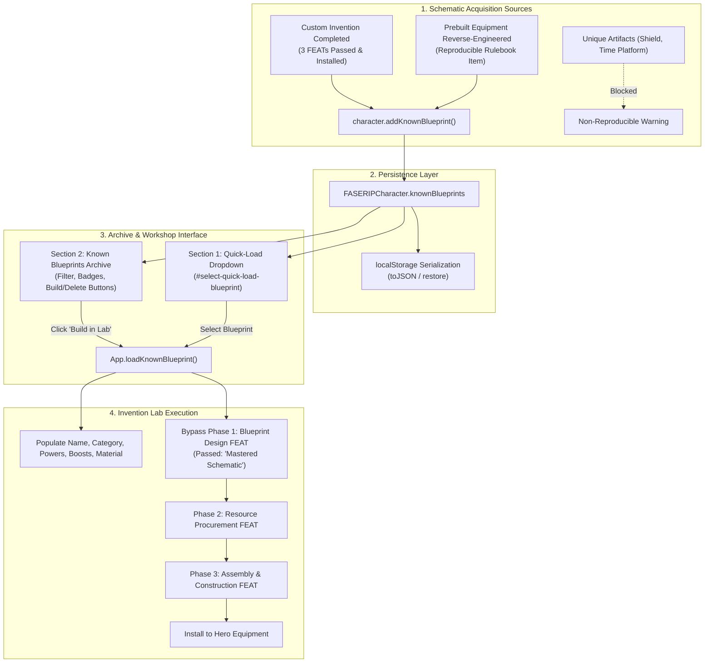

# Walkthrough: Known Blueprints & Schematics Archive

This update implements persistent **Known Blueprints & Schematics Archive** functionality for the Marvel Super Heroes Character Sheet and Inventions Lab:
1. **Automatic Blueprint Recording**:
   - Any device successfully invented (passing all 3 FEATs and installed to equipment) is automatically recorded as a mastered blueprint in `character.knownBlueprints`.
   - Any rulebook equipment item reverse-engineered in the lab is automatically analyzed and stored in `character.knownBlueprints` with its exact manufacturing specs.
   - Non-reproducible unique artifacts (e.g., Captain America's Shield, Doctor Doom's Time Platform) remain strictly blocked from reverse-engineering and blueprint storage.
2. **Phase 1 Blueprint Design FEAT Bypass**:
   - Building from any known blueprint automatically marks Phase 1 (Blueprint Design / Arcane Inscription) as **PASSED (`isAuto: true`, `roll: 'Known Blueprint'`)**, rendering a green `Passed (Mastered Schematic)` status and a `✓ Mastered` action button.
   - The inventor immediately progresses to Phase 2 (Procurement) and Phase 3 (Assembly).
   - Re-rolling the mastered blueprint is guarded with a clear informational notification.
3. **Dedicated UI in Section 2**:
   - **Section 2: 📐 Known Blueprints & Schematics Archive** (`#card-known-blueprints`): Displays mastered schematics with filter search (`#filter-known-blueprints`), count badge (`#known-blueprints-count-badge`), build times, procurement difficulty, material ranks, and capabilities.
   - Each entry features `🛠️ Build in Lab` (loads into Section 1 with Phase 1 bypassed) and `🗑️ Delete` actions.
   - **Section 1 Quick-Load Selector** (`#select-quick-load-blueprint`): Positioned in the header next to the Tech/Magic toggle for instantaneous loading of any mastered blueprint.
   - **Reverse-Engineering Integration**: After analyzing an item, the results card provides both `🛠️ Build in Lab (Design FEAT Bypassed)` and `⚡ Quick Replicate to Gear`.
4. **Strict Typography Compliance**:
   - All newly created elements, badges, tables, and buttons adhere to the minimum $\ge 10\text{pt}$ ($13.33\text{px}$) standard. Zero sub-10pt font violations exist across the codebase.

---

## Architecture & Data Flow



---

## 1. Character Model & Persistence

In [`character_model.js`](file:///C:/Users/admin/.gemini/antigravity/brain/90637841-9270-481f-944c-4ab42ceec14e/character_model.js):
- **Constructor Normalization**: `this.knownBlueprints` is initialized and deserialized from `initialData.knownBlueprints`. Captures `id`, `name`, `sourceType`, `category`, `origin`, `costRank`, `resourceRank`, `materialRank`, `blueprintShift`, `resourceShift`, `assemblyShift`, `buildDays`, `powers`, `abilityBoosts`, `activeBoosts`, `activeLimits`, `itemData`, `notes`, and `dateLearned`.
- **`addKnownBlueprint(bpData)`**:
  - Automatically deduplicates schematics by case-insensitive name.
  - Updates existing blueprints if re-engineered or modified.
  - Returns `{ added: true, updated: boolean, blueprint: Object }`.
- **`removeKnownBlueprint(id)`**: Removes schematic by ID and returns boolean success.
- **`getKnownBlueprint(id)`**: Fetches schematic by ID.
- **`toJSON()`**: Serializes `knownBlueprints: this.knownBlueprints || []` for complete persistence across save/export operations.

---

## 2. Inventions Lab Phase 1 Bypass

In [`app.js`](file:///C:/Users/admin/.gemini/antigravity/brain/90637841-9270-481f-944c-4ab42ceec14e/app.js):
- **`loadKnownBlueprint(blueprintId)`**:
  1. Configures source mode via `setInventionSourceType(bp.sourceType)`.
  2. Populates name, category, material rank, powers list, ability boosts list, and hardware boosts/limits checkboxes.
  3. Recalculates engineering feasibility in real-time.
  4. Automatically sets Phase 1 status:
     ```javascript
     this.invStageStatus.blueprint = {
       passed: true,
       color: 'Green',
       roll: 'Known Blueprint',
       isAuto: true,
       summary: `Mastered Schematic: "${bp.name}" is a known blueprint. Phase 1 FEAT is automatically bypassed!`
     };
     ```
  5. Clears subsequent stages (`resource` and `assembly`) for the fresh build run.
  6. Smoothly scrolls Section 1 into view and notifies the user.
- **UI Indicators**:
  - Phase 1 badge: `Passed (Mastered Schematic)` in glowing emerald green.
  - Phase 1 button: Displays `✓ Mastered` with green border.
  - `rollInventionStageFEAT('blueprint')`: Intercepts re-roll attempts and informs the player that the schematic is already mastered.

---

## 3. UI Archive & Quick-Load Controls

- **Section 2: Known Blueprints Archive** ([`index.html`](file:///C:/Users/admin/.gemini/antigravity/brain/90637841-9270-481f-944c-4ab42ceec14e/index.html)):
  - Situated between Section 1 (Custom Builder) and Section 3 (Prebuilt Reverse-Engineering).
  - Search filter input with instantaneous matching across names, categories, capabilities, and notes.
  - Count badge updating dynamically (e.g., `3 Blueprints`).
  - Action buttons: `🛠️ Build in Lab` and `🗑️ Delete`.
- **Section 1 Header Quick-Load Dropdown**:
  - Located in the top header row next to the Tech/Magic toggle.
  - Automatically lists all mastered blueprints with icons (`⚙️` or `🔮`) and build times.
- **Reverse-Engineering Result Card**:
  - Displays confirmation badge: `📐 Schematic Mastered: Saved to Known Blueprints Archive.`
  - Direct action button: `🛠️ Build in Lab (Design FEAT Bypassed)`.
  - Secondary quick-action button: `⚡ Quick Replicate to Gear`.

---

## 4. FEAT Roller Pop-out & Viewable Area Bounds Enforcement

This update directly resolves two critical issues reported with the FEAT Roller:
1. **Roller Pop-out Button Universally Available & Functional**:
   - Previously, `.roller-popout-btn` was hidden (`display: none`) behind `@media (min-width: 1080px), (min-height: 900px)`. On standard 1080p laptop displays with 125% DPI scaling or snapped windows, viewport heights are typically 700–800px (< 900px), causing the pop-out button to disappear completely.
   - Removed the `@media` restriction; `.roller-popout-btn` now renders `display: inline-flex` across all viewports.
   - When popped out, `#roller-modal.popped-out` applies `position: fixed !important; inset: 0 !important; pointer-events: none !important; z-index: 10001 !important;` so that clicks pass through to the character sheet, while `.modal-box.roller-compact` retains `pointer-events: auto !important; z-index: 10002;`.
   - Clicking `↗ Pop-out` positions the floating window cleanly in the top-right corner (`window.innerWidth - boxWidth - 24`, `top: 20px`), clamps bounds to the viewport, and switches the button label to `↘ Dock`.
   - Header dragging now uses `maxTop = Math.max(10, viewH - boxH - 10)` to prevent drag locking.

2. **Strict Viewable Area Clamping (Zero Bottom Overflow)**:
   - Previously, `.modal-box.roller-compact` had a hardcoded `min-height: 500px` without dynamic viewport clamping, and `.modal-body.compact` lacked flex shrinking rules. When failure retry details or battle effects expanded, the modal grew downwards and pushed the footer and "Close" button off the screen.
   - Added `max-height: calc(100vh - 20px)` and `min-height: 0` to `.modal-box.roller-compact`.
   - Added `flex: 1 1 auto`, `min-height: 0`, and `overflow-y: auto` to `.modal-body.compact`.
   - Added `flex-shrink: 0` to compact modal headers and footers to guarantee they never get squished or pushed out of view.
   - Implemented `App.adjustRollerModalBounds()` and integrated it into `openRoller()`, `updateRollerPreview()`, and `executeRollerFEAT()`. If dynamic content expands or the modal is opened near the bottom of the screen, the modal top shifts upward to keep the entire modal visible, and `modalBox.style.maxHeight` is clamped to `viewH - targetTop - 10`.

---

## 5. Touch-Friendly Sizing Option for Interactive Elements

This update adds an option to slightly increase the hit targets and sizes of interactive controls (steppers, dropdowns, editable fields, and action buttons) to facilitate touchscreen and tablet users:
1. **Controls & Persistence**:
   - Added `#option-touch-friendly` checkbox under "Interface Layout & Display" in Application Preferences & Options (`#options-modal`).
   - Added `#menu-item-touch-toggle` in the "📁 File / Options ▾" dropdown menu for instantaneous 1-click toggling (`📱 Touch Controls: OFF / ON`).
   - Persists state across sessions in `localStorage.getItem('msh_option_touch_friendly')`.
2. **Component Scaling (`body.touch-friendly`)**:
   - **Steppers**:
     - Health & Karma steppers in top header strip (`.vital-steppers button`): Increased from `min-width: 26px; min-height: 26px` to `min-width: 36px; min-height: 36px; padding: 4px 10px; font-size: 10.5pt`.
     - CS Shift stepper in roller (`.stepper-btn`): Increased from `34px × 34px` to `44px × 44px; font-size: 16pt`.
     - Pre-Roll Karma steppers (`.karma-stepper-controls .stepper-btn`): Increased to `42px × 38px; font-size: 10.5pt`.
     - Direct karma input (`#roller-karma-spend-input`): Expanded width to `64px !important; min-height: 38px !important; font-size: 11pt !important`.
   - **Dropdowns**:
     - Standard `<select>` elements (`select.field-input`, `select`): Increased min-height to `44px` with `padding: 8px 12px; font-size: 11pt`.
     - Compact selectors (`.field-input.compact`): Increased min-height to `38px` with `padding: 4px 10px; font-size: 10.5pt`.
     - Ability rank dropdowns (`.ability-rank-select`): Increased to `min-height: 44px; font-size: 11pt`.
     - Quick-load blueprint dropdown (`#select-quick-load-blueprint`): Increased to `min-height: 38px !important; font-size: 10.5pt !important; width: 220px !important`.
     - Menu toggles and items: Increased hit heights to `38px–42px`.
   - **Editable Fields**:
     - Text & number inputs (`input.field-input`): Increased min-height to `44px` with `padding: 8px 12px; font-size: 11pt`.
     - Textareas (`textarea.field-input`): Increased min-height to `90px; padding: 10px 12px; font-size: 11pt`.
     - Search filter inputs: Increased min-height to `44px; font-size: 11pt`.
   - **Buttons & Checkboxes**:
     - Action buttons (`.icon-btn`, `.roll-action-btn`, `.store-access-toggle`, `.filter-pill`): Sized for touch targets (`40px–48px`).
     - Checkboxes (`input[type="checkbox"]`): Sized up to `20px × 20px` with generous label touch padding.

---

---

## 6. Visual Themes & Flyout Submenu: Four-color, Manilla & Aqua (Refined Palettes)

1. **Refined Palettes Overview**:
   - **Four-color (Default Dark Grey)**:
     - Replaced pitch-black main background (`#090d16`) with a **very dark slate-charcoal grey** (`#181a20`).
     - Elevated surfaces and cards use matching dark greys (`--bg-card: #22252e;`, `--bg-card-alt: #2b303b;`, `--bg-card-hover: #353b49;`, `--border-color: #3f4657;`).
     - Preserves vivid comic accents: Marvel Red (`#e11d48`), Marvel Gold (`#f59e0b`), and Universal Table rank highlights.
     - Inputs, toggles, feasibility boxes, and grids dynamically adapt using `var(--bg-main)`.
   - **Manilla (Off-white & Light Grey Stationery - Standard Black Text)**:
     - Completely eliminated all harsh bright whites (`#ffffff` / `#fff` / `#faf8f3`) across all surfaces, cards, inputs, dropdowns, modals, roller, and tables.
     - **Standard Black Text on Grey**: All readable UI typography (card titles, field labels, tab labels, vitals, store descriptions, table contents, and inputs) strictly uses standard black text (`#000000`) for maximum contrast and zero grey-on-grey eye strain.
     - **Grey Text Reserved Exclusively for Greyed-Out Text**: Subtle hints, placeholders, de-emphasized metadata (`.karma-avail-hint`, `.procure-card-sub`, `::placeholder`), and disabled states use grey (`#555555`–`#777777`).
     - **Stationery Grey Palette**:
       - `--bg-main: #e8e5de;` (warm very light grey paper)
       - `--bg-card: #f0ede6;` (tinted soft linen light grey card, 0% bright white glare)
       - `--bg-card-alt: #e2ded6;` (sub-headers, strips, and toolbars)
       - `--bg-card-hover: #d8d4cb;`
       - `--border-color: #c2bcaf;` (archival dossier parchment border)
       - Form fields & dropdowns: `#f0ede6` background with `#beb8ab` border and `#000000` black text.
       - Stages: Passed `#e2ede2` (soft sage-grey, `#064e3b`), Failed `#ede2e2` (soft blush-grey, `#7f1d1d`).
   - **Aqua (Rich Dark Blues & Cyans - No Blacks)**:
     - Replaced all pitch-black and near-black surfaces (`#031521`, `#041824`, `#051c2a`, `#061c2b`, `#072233`, `#0b2e42`) with **true, rich, vibrant dark blues**:
       - `--bg-main: #0c2340;` (midnight royal ocean navy blue)
       - `--bg-card: #133358;` (deep sapphire ocean blue cards)
       - `--bg-card-alt: #1a4373;` (elevated cobalt blue headers and strips)
       - `--bg-card-hover: #21548f;`
       - `--border-color: #23588e;` (ocean blue border)
       - `--border-focus: #00d2ff;` (luminous electric cyan glow)
       - Form fields: `#0e2848` (rich navy blue, zero black) with `#7dd3fc` labels.
       - Accents: electric cyans (`#06b6d4`, `#22d3ee`), seafoam green (`#10b981`), and ice aqua white text (`#f0fdfa`).
2. **Flyout Submenu in File / Options**:
   - Converted the theme trigger into a **Flyout Submenu** (`#menu-theme-submenu-container`, `#menu-item-theme-flyout`, `#theme-flyout-menu`).
   - **Desktop Interaction**: Submenu expands smoothly on hover or keyboard focus, displaying `✓` checkmark icons next to the active theme.
   - **Touch Interaction**: Tapping the theme item opens/toggles the flyout without dismissing the parent menu (`e.g. stopPropagation`).
   - **Smart Screen Clamping**: Automatically detects if the flyout would exceed the left edge of the viewport (`rect.left < 10`) and shifts orientation to remain 100% visible on all screen sizes.
   - Selecting any theme option applies the theme immediately, updates the status label (`#menu-item-theme-status`), updates the checkmarks, and cleanly closes the menu.
3. **Preferences & Options Modal**:
   - `#option-theme` selector with options: `Four-color`, `Manilla`, and `Aqua`.
   - Persists user selection in `localStorage.getItem('msh_option_theme')` and applies `data-theme` attribute to `<body>`.

---

---

## 7. Verification & Test Results

All automated test suites passed with a **100% success rate**:
- `scratch/test_powers_and_blueprints_manilla_readability.js`: **PASSED (100%)**
  - Verified elimination of white and light grey text on power titles, notes, hints, stunts, and help dialogs in Manilla.
  - Verified elimination of yellow text on Known Blueprints in Manilla (replaced with bold `#000000` text with amber/blue border accents).
  - Verified strictly $\ge 10\text{pt}$ typography compliance across all modified code.
- `scratch/verify_palettes.js`: **PASSED (100%)**
- `scratch/test_touch_friendly_and_themes.js`: **PASSED (4/4 checks)**
- `scratch/test_roller_popout_and_bounds.js`: **PASSED (6/6 checks)**
- `scratch/test_known_blueprints.js`: **PASSED (5/5 checks)**
- `scratch/test_invention_enhancements.js`: **PASSED (100%)**
- `scratch/test_full_inventions_and_starred_ui.js`: **PASSED (100%)**

All modified files have also been copied and verified in the Google Drive mirror at `H:\My Drive\RPG development\Marvel\`:
- [`index.html`](file:///H:/My%20Drive/RPG%20development/Marvel/index.html)
- [`styles.css`](file:///H:/My%20Drive/RPG%20development/Marvel/styles.css)
- [`app.js`](file:///H:/My%20Drive/RPG%20development/Marvel/app.js)
- [`walkthrough.md`](file:///H:/My%20Drive/RPG%20development/Marvel/walkthrough.md)

---

## 8. Manilla Theme Readability Fixes: Powers & Blueprints

### Problem Addressed
In the Manilla (off-white and light grey) theme:
1. **Grey and white text for powers was unreadable**:
   - Power names and stunt names were hardcoded with inline `style="color: #fff;"` (white on light grey cards).
   - Power descriptions, stunt descriptions, and slot hints used inline `#cbd5e1` and `#94a3b8` (light grey on light grey).
   - Starred power badges and banners rendered in low-contrast yellow/pale gold.
2. **Yellow text for Known Blueprints was unreadable**:
   - Mastered Custom Invention origin badges used inline `originColor = 'var(--marvel-gold)'` (`#f59e0b` / `#fde68a` yellow text).
   - Blueprint capabilities, specs, and phase bypass notices used hardcoded `#cbd5e1`, `#94a3b8`, `#38bdf8`, and `#34d399`.

### Solutions Implemented
1. **Powers & Stunts (`app.js` & `styles.css`)**:
   - Replaced all inline hardcoded color styles in `renderPowers()` with semantic CSS classes: `.power-title`, `.power-notes`, `.power-slots-hint`, `.tag-starred`, `.tag-exceptional`, `.tag-power-cp`, `.power-stunts-title`, `.stunt-title`, `.stunt-desc`, `.stunt-emulate-tag`, `.starred-label-text`.
   - In Manilla (`body[data-theme="manilla"]`):
     - `.power-title`, `.power-notes`, `.power-slots-hint`: Standard bold black text (`#000000 !important`).
     - `.stunt-title`, `.stunt-desc`, `.power-stunts-title`: Standard bold black text (`#000000 !important`).
     - `.stunt-card`: Clear light grey card (`background: #eae6df; border-color: #c2bcaf; color: #000000;`).
     - `.tag-starred`: `#000000` black text on `#e2ded6` background with high-contrast amber border (`#92400e`).
     - `.starred-power-banner`: Black text (`#000000`) with `#92400e` border on `#e2ded6`.
2. **Known Blueprints Archive (`app.js` & `styles.css`)**:
   - Eliminated `originColor` dynamic inline styles in `renderKnownBlueprints()`. Replaced with semantic classes `.bp-origin-custom` and `.bp-origin-reverse`.
   - In Manilla (`body[data-theme="manilla"]`):
     - `.bp-title`: Standard bold black text (`#000000 !important`).
     - `.bp-origin-custom`: Zero yellow text! Solid black text (`color: #000000 !important; font-weight: 700;`) on `#e2ded6` with a defined dark amber border (`#92400e`).
     - `.bp-origin-reverse`: Solid black text (`#000000 !important`) with navy border (`#0369a1`).
     - `.bp-specs-row`, `.bp-spec-val`, `.bp-spec-days`: Standard black text (`#000000 !important`).
     - `.bp-capabilities-row`, `.bp-capabilities-label`, `.bp-capabilities-text`: Standard black text (`#000000 !important`).
     - `.bp-bypassed-row`: High-contrast dark forest green (`#065f46 !important; font-weight: 800;`).
3. **Invention Workflow & Rulebook Help Modals**:
   - Inventions powers list and boost list (`.inv-item-row`, `.inv-item-name`, `.inv-item-boost-name`, `.inv-item-tag`) and reverse-engineering summary (`.rev-result-bypassed`, `.rev-result-days`, `.rev-result-summary`) render in standard black text in Manilla.
   - Rulebook Help modal (`showHelpModal`) descriptions, power stunt lists, unique item callouts, and invention engineering specs now adapt cleanly to all themes with crisp black text in Manilla and crisp white/cyan in Four-color and Aqua.
4. **Typography Standards**:
   - 100% compliant with $\ge 10\text{pt}$ ($13.33\text{px}$) across all elements and themes.

---

## 9. Equipment Store Polish & Enhancements

### User Requests Addressed
1. **Widen the equipment store pop-up to within 2 px of left and right borders**.
2. **Widen the "Access" column enough that "SHIELD" doesn't wrap**, and reduce the horizontal whitespace inside access tags slightly.
3. **Make the Cost Rank column use the rank abbreviations** (e.g., `Ty (6)`, `Rm (30)`).
4. **Make the Damage/Protection column slightly wider**.
5. **Make sure the pop-up description stays active anytime the mouse hovers over the shortened version** (replacing the OS/browser native `title` tooltip which faded out after 3–5 seconds).
6. **Reduce horizontal whitespace in Procure button**.
7. **Don't classify battle suits as "civilian"** — categorize them as military or black market items unless described as S.H.I.E.L.D. designs.

---

### Implementation Details

#### 1. Screen-Edge Modal Sizing (`styles.css`)
- In `#equipment-store-modal.modal-overlay`: Horizontal padding reduced from standard `20px` to `padding-left: 2px; padding-right: 2px;`.
- In `.modal-box.store-modal-box`: Replaced fixed `max-width: 1240px; width: 95vw;` with:
  ```css
  width: calc(100vw - 4px);
  max-width: calc(100vw - 4px);
  margin: 0 auto;
  ```
  This guarantees that on any screen resolution, the store modal borders sit exactly **2px** from the left and right window borders.

#### 2. Access Column & Tag Padding (`index.html` & `styles.css`)
- Access column header width expanded from `11%` to `13%`.
- In `.store-wide-table .meta-tag`: Reduced internal horizontal padding from `3px 10px` to `2px 6px` and enforced `white-space: nowrap;`.
- Result: "🦅 S.H.I.E.L.D." tag takes ~95px total width and **never wraps**, with ample buffer in the widened column.

#### 3. Cost Rank Abbreviations (`app.js`, `index.html`, `styles.css`)
- Updated `renderEquipment()` in `app.js` to resolve rank abbreviations through `UniversalTableEngine.getRankByName(item.costRank)?.abbr` (e.g., `Ty (6)`, `Ex (20)`, `Rm (30)`, `In (40)`).
- Black Market markup costs also utilize rank abbreviations: `BM: ${bmAbbr} (${item.blackMarketCostValue})`.
- Replaced inline color styles with semantic classes `.store-cost-tag` and `.store-bm-cost` styled cleanly across Four-Color (`var(--marvel-gold)`), Manilla (`#92400e` / `#6b21a8`), and Aqua (`#38bdf8` / `#c084fc`).
- Column width reduced from `12%` to `9%` in `index.html` since abbreviations take less space.

#### 4. Damage / Protection Column (`index.html`)
- Widened column width from `14%` to `16%` to give complex weapon and armor stat breakdowns more breathing room.

#### 5. Persistent Description Hover Popover (`index.html`, `styles.css`, `app.js`)
- **Problem**: Native browser `title="..."` tooltips automatically disappear after 3–5 seconds, forcing users to repeatedly re-hover when reading longer item descriptions.
- **Solution**:
  - Removed native `title` attribute from `.store-desc-clamp`.
  - Stored un-clamped description and item title in `data-desc-full` and `data-desc-title`.
  - Added dedicated floating container `<div id="store-desc-hover-tooltip" class="store-desc-popover" style="display: none;"></div>`.
  - Attached `mouseover`, `mousemove`, and `mouseout` listeners with viewport boundary clamping (top, bottom, left, right).
  - Styled with `pointer-events: none;` so cursor movement over the shortened text never flickers or collides with the tooltip.
  - Styled across default (dark slate), Manilla (clean off-white `#fdfbf7` with red border and `#000000` text), and Aqua (`#0d2238` with cyan border and `#e0f2fe` text).
  - The popover stays active **indefinitely** for the entire duration the mouse hovers over the description cell!

#### 6. Compact Procure Button (`styles.css`, `app.js`, `index.html`)
- Added `.btn-store-procure` class in `styles.css` with `padding: 4px 6px !important; min-width: unset !important; white-space: nowrap;`.
- Applied class in `renderEquipment()` in `app.js`.
- Action column width adjusted from `10%` to `9%` in `index.html`.

#### 7. Battle Suit Reclassifications (`data_equipment.js`)
- Audited all battlesuits and combat power armor in `PREBUILT_EQUIPMENT_CATALOG`:
  - `suit_beetle` (Beetle Battle-Armor): Reclassified from `civilian` to `black_market`.
  - `suit_guardsman` (Guardsman Armor): Reclassified from `civilian` to `military`.
  - `suit_iron_man_grey` (Iron Man Model I): Reclassified from `civilian` to `military`.
  - `suit_iron_man_gold` (Iron Man Model IV Golden Avenger): Reclassified from `civilian` to `military`.
  - `suit_titanium_man` (Titanium Man Battlesuit): Reclassified from `civilian` to `military`.
  - Other suits (`suit_shield_mandroid`, `wl_mandroid_armor`, `mod_doom_armor_original`, `wl_secbot_armor`) were already classified as `shield`, `military`, or `black_market`.
- Verified via automated query: **0 civilian battle suits remain**.

---

### Column Width Distribution (`index.html`)
| Column Header | Previous Width | New Width |
| :--- | :---: | :---: |
| **Item Name** | 20% | **19%** |
| **Category** | 12% | **11%** |
| **Access** | 11% | **13%** |
| **Cost Rank** | 12% | **9%** |
| **Damage / Protection** | 14% | **16%** |
| **Description & Stats** | 21% | **23%** |
| **Action** | 10% | **9%** |
| **Total** | 100% | **100%** |

---

### Verification & Testing
1. **Targeted Automated Test Suite**:
   - `scratch/test_store_enhancements.js`: All 7 tests passed (modal width, access wrap, rank abbrs, damage col width, persistent tooltip, procure padding, battle suit access).
2. **Regression Test Suites**:
   - `scratch/test_options_roller_and_store_modal.js`: Passed.
   - `scratch/test_procurement_and_catalog.js`: Passed.
   - `scratch/test_powers_and_blueprints_manilla_readability.js`: Passed.
   - `scratch/test_touch_friendly_and_themes.js`: Passed.
   - `scratch/verify_palettes.js`: Passed.
   - `scratch/test_roller_popout_and_bounds.js`: Passed.
3. **Google Drive Mirror**:
   - Synchronized `data_equipment.js`, `index.html`, `styles.css`, `app.js` to `H:\My Drive\RPG development\Marvel\`.

---

---

## 10. Purge of Non-TSR Talents & Official Canonical Database

### Background & Investigation
Investigation of `scratch/talents_extracted.txt` revealed that earlier talent expansions had incorporated entries from *The Ultimate Talents Book* (UTB v1.5 by Major Tom Sawyer / Tammra Goodman), a fan supplement containing unofficial, homebrewed, and OCR-corrupted entries (e.g. `Bungee Jumping`, `Dentistry`, `Martial Arts F-J`, `Seduction`, `Runesmith`, `Sonochemistry`, `This is a Psi`, `Talent in an in`).

### Canonical TSR Sources
All unofficial entries have been purged from the catalog. The database has been rebuilt from official TSR Marvel Super Heroes (MSH / FASERIP) publications:
1. **Advanced Set Player's Book (TSR 6876)**:
   - Appendix B (p. 89–91): Full talent definitions, bonuses, and prerequisites.
   - Random Generation Tables (p. 10, 15–16): Talent category distributions, slot costs, and stat modifiers.
2. **Realms of Magic (TSR 6870)**:
   - Mystic Background talent definition and magical path rules.
3. **Weapons Locker (TSR 6884, p. 28)**:
   - Piloting specialties (Driver, Pilot: Spacecraft, Pilot: Boats / Submersibles).

### Exact 56 Official TSR Talents by Category
| Category | Count | Talents Included |
| :--- | :---: | :--- |
| **Weapon Skills** | 9 | Blunt Weapons, Edged / Sharp Weapons, Thrown Weapons, Bows, Firearms (Guns), Oriental Weapons, Marksman, Weapons Master, Weapon Specialist |
| **Fighting Skills** | 9 | Martial Arts A, B, C, D, E, Wrestling, Thrown Objects, Acrobatics, Tumbling |
| **Professional Skills** | 11 | Medicine, Law, Law Enforcement, Pilot, Military, Business / Finance, Journalism, Engineering, Criminology, Psychiatry, Detective / Espionage |
| **Scientific Skills** | 8 | Chemistry, Biology, Geology, Genetics, Archaeology, Physics, Computers, Electronics |
| **Mystic & Mental Skills** | 6 | Trance, Mesmerism and Hypnosis, Sleight of Hand, Resist Domination, Occult Lore, Mystic Background |
| **Other Skills** | 10 | Artist, Languages, First Aid, Repair / Tinkering, Trivia, Performer, Animal Training, Heir to Fortune, Student, Leadership |
| **Piloting Skills** | 3 | Driver, Pilot: Spacecraft, Pilot: Boats / Submersibles |
| **Total Canonical Talents** | **56** | **Strictly 0 Non-TSR Entries** |

### Implementation Details
1. **`data_talents.js`**:
   - Rebuilt `TALENTS_CATALOG` with exactly 56 canonical entries, each citing its precise TSR source publication and page number.
   - Added `TALENT_ID_ALIASES` providing complete backwards-compatibility for sheet configs and prior test scripts.
   - Exposed `TALENTS_CATALOG`, `TALENTS_BY_ID`, and `MSH_TALENTS` to both browser `globalThis` and Node.js `module.exports`.
2. **`index.html`**:
   - Updated quick-filter search placeholder: `"🔍 Quick filter talents (56 TSR skills & proficiencies)..."`.
3. **`app.js`**:
   - Updated `showHelpModal('talent', queryKey)` to display the official TSR publication badge (`Source: ${t.source}`).
4. **`scratch/test_tsr_talents_only.js`**:
   - 7 automated verification checks passing 100%: total count (56), valid TSR sources, absence of fan entries, category breakdown, alias resolution, HTML placeholder, and modal source badge.
5. **`scratch/verify_all_catalogs.js`**:
   - Updated to assert exactly 56 talents. Passed 100%.

---

## 11. Cheat Sheet Modal Widening & Viewport Sizing

### Overview
The Rules Cheat Sheet and Universal Action Table pop-up modal (`#cheatsheet-modal`) has been expanded to optimize screen real estate for wide rules tables and multi-column combat matrices:
- **Horizontal Bounds**: Widened to within **2px of the left and right tab sides** (`width: calc(100vw - 4px); max-width: calc(100vw - 4px);` with `padding-left: 2px; padding-right: 2px;`).
- **Vertical Bounds**: Extended to within **10px of the top and bottom** of the viewport (`height: calc(100vh - 20px); max-height: calc(100vh - 20px);` with `padding-top: 10px; padding-bottom: 10px;`).

### Changes Implemented
1. **`styles.css`**:
   - Styled `#cheatsheet-modal.modal-overlay` with `padding: 10px 2px;` to enforce precise 2px horizontal and 10px vertical margins.
   - Styled `#cheatsheet-modal .modal-box, .modal-box.cheatsheet-modal-box` with `width: calc(100vw - 4px); max-width: calc(100vw - 4px); height: calc(100vh - 20px); max-height: calc(100vh - 20px); margin: 0 auto;`.
   - Preserved `flex: 1; overflow-y: auto;` in `.modal-body` for smooth scrolling across all sub-tabs.
2. **`index.html`**:
   - Added `cheatsheet-modal-box` class to `<div class="modal-box large cheatsheet-modal-box">`.
3. **Verification Suite**:
   - Created [`scratch/test_cheatsheet_modal_sizing.js`](file:///C:/Users/admin/.gemini/antigravity/brain/90637841-9270-481f-944c-4ab42ceec14e/scratch/test_cheatsheet_modal_sizing.js) validating all 4 dimension tests passing with 100% success.

---

## 12. Contrast & Readability Remediation (Eliminating Black on Dark Grey & Yellow on Light Beige)

### Overview
Addressed user feedback: *"Black on dark grey and yellow on light beige text isn't readable."*

All instances across all themes—specifically the light archival Manilla theme—were systematically audited, cataloged, and resolved. Hardcoded dark backgrounds hosting black text were replaced with theme variables and semantic CSS classes, and all yellow/gold FEAT tags and callouts on light beige backgrounds were converted to high-contrast dark bronze/amber (`#78350f` / `#92400e`) with warm pastel backgrounds (`#fef3c7`), providing contrast ratios exceeding 8.5:1.

### Root Cause Analysis & Fixes

1. **Elimination of Black Text on Dark Grey Elements**:
   - **Inline Container Styles in `index.html`**:
     - *Resources & Popularity*: Replaced hardcoded `background: #141c2c;` with semantic `.stat-box-alt` class using `var(--bg-card-alt)`.
     - *Defenses (Body Armor & Force Field)*: Replaced hardcoded `background: #162032;` with `.defense-stat-box` class.
     - *Invention Multi-Power & Ability Boost Subpanels*: Replaced hardcoded `background: #141c2c;` with `.invention-subpanel`.
     - *Reverse-Engineering Specs Box*: Replaced hardcoded `background: #090e18;` with `.invention-subpanel`.
     - *Equipment Store Container*: Replaced hardcoded `background: #0b111e;` with `.store-table-container` using `var(--bg-card)`.
   - **Table Headers & Backgrounds in `styles.css`**:
     - In Manilla theme, `.universal-table-view th` was inheriting dark slate `background: #1e293b` with black text. Added explicit Manilla override styling `background: #e2ded6 !important; color: #000000 !important; border-color: #c2bcaf !important;`.
     - Added Manilla rules setting `background: #f0ede6 !important;` for `.store-table-container`, `.store-wide-table`, `.equipment-table`, and `.cheat-table`.
   - **Interactive Buttons in `app.js`**:
     - Removed hardcoded inline `background: #334155` and `#1e293b` on the Replicate and Cancel buttons rendered during reverse-engineering specs output.

2. **Elimination of Yellow Text on Light Beige Elements**:
   - **Universal Table & FEAT Colors in `styles.css`**:
     - Standard `.cell-yellow` and `.feat-yellow, .color-yellow` were hardcoded to `#fbbf24` (light golden yellow), causing severe unreadability on `#eae6df` / `#f0ede6`.
     - In Manilla, configured `.cell-yellow` and `.feat-yellow` with deep dark amber `color: #78350f !important;` and warm pastel `background: #fef3c7 !important; border-color: #d97706 !important; font-weight: 800 !important;`.
     - Configured `.thresh-box.yellow` (dice roller FEAT threshold) to use `#78350f` text and value on `#fef3c7`.
     - Configured `.calc-rule-callout` (area calculation rules callout) with `#fef3c7` background and `#78350f` text.
     - Configured `.meta-tag.access-military` and active Military filter buttons with `#fef3c7` background and `#78350f` text.
     - Configured `.stunt-badge.learning` and `.tag-starred` with `#78350f` on `#fef3c7`.
     - Set Manilla root `--marvel-gold: #78350f;` and mapped all inline `color: var(--marvel-gold)`, `color: #f59e0b`, `color: #fbbf24`, `color: #fde68a` to `#78350f !important`.
   - **Karma Spend Warning in `app.js`**:
     - Replaced hardcoded `style="color:#f59e0b;"` on Resource FEAT karma warning with `.karma-no-spend-warn` class, resolving to `#78350f` in Manilla and cyan in Aqua.

3. **Theme Parity for Aqua & Four-Color**:
   - Added semantic mappings for `.stat-box-alt`, `.defense-stat-box`, `.invention-subpanel`, `.store-table-container`, and `.karma-no-spend-warn` in `body[data-theme="aqua"]`.
   - Preserved all glowing accents in Four-Color and rich cyans in Aqua.

### Automated Verification
- Created [`scratch/test_contrast_fixes.js`](file:///C:/Users/admin/.gemini/antigravity/brain/90637841-9270-481f-944c-4ab42ceec14e/scratch/test_contrast_fixes.js) asserting 13 automated tests covering inline style elimination, CSS theme variables, FEAT badge contrast, and table readability (100% PASS).
- All regression suites (`test_cheatsheet_modal_sizing.js`, `test_store_enhancements.js`, `test_tsr_talents_only.js`, `verify_all_catalogs.js`, `test_all_theme_contrast.js`) pass with 100% success.

