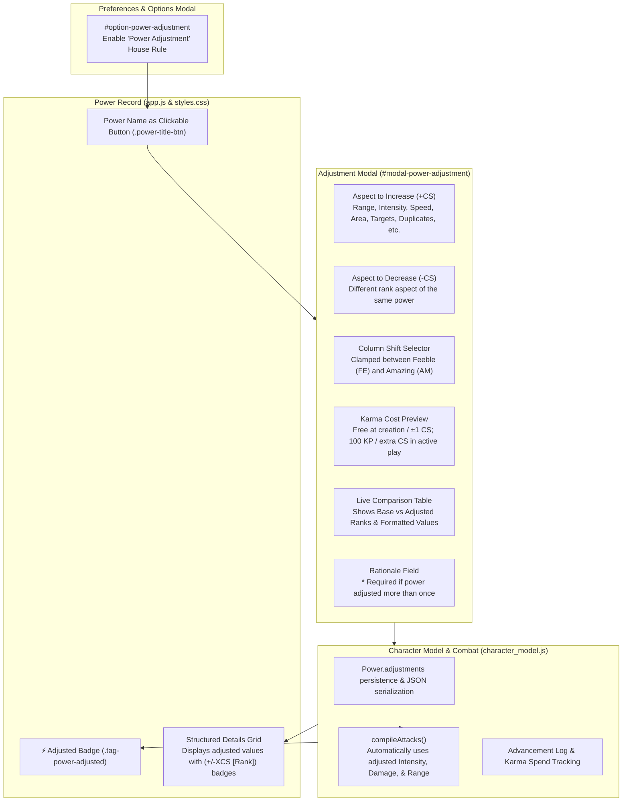

# Walkthrough: Power Adjustment House Rule & System Enhancements

This walkthrough documents the implementation of the optional **Power Adjustment** house rule, allowing heroes to trade rank-based statistics within a single power with balanced Column Shifts, capped at **Amazing (AM)** and **Feeble (FE)**, with full character creation / active play Karma mechanics and in-game explanation enforcement.

---

## 1. Power Adjustment House Rule Overview

### Core Mechanics & Rules
1. **Rank Trade-Off within Same Power**:
   - A player can apply a permanent $+X$ Column Shift (CS) to one rank-based aspect of a power (e.g., Range, Intensity, Duration, Area of Effect, Number of Targets, Flight/Land Speed, Duplicates Created, Designs Memorized, Weight Capacity, Elongation Reach) while applying an equal $-X$ CS to a different aspect of the *same* power.
   - Adjustments cannot be split across multiple powers.
2. **Rank Boundaries**:
   - **Upper Bound**: No aspect can be adjusted above **Amazing (AM)** (capped at 50 in Standard or CMF table).
   - **Lower Bound**: No aspect can drop below **Feeble (FE)** (capped at 2 in Standard or CMF table).
   - Single-aspect powers (e.g. Body Armor, which only possesses Protection intensity) display an informative notice that a secondary rank-based stat is required to shift.
3. **Karma Costs**:
   - **At Character Creation**: All power adjustments are **Free (0 KP)**.
   - **In Active Play**: A $+1 / -1$ CS combo is **Free (0 KP)**.
   - Shifts of more than 1 CS cost **100 KP per extra column shifted** ($2\text{ CS} = 100\text{ KP}$, $3\text{ CS} = 200\text{ KP}$, $N\text{ CS} = (N - 1) \times 100\text{ KP}$).
   - Costs are deducted from available Karma with an advancement log entry: `Power Adjustment: [Power Name] (+XCS [Aspect A] / -XCS [Aspect B])`.
4. **Re-Adjustment & In-Game Rationale**:
   - Adjustments are permanent modifications to the power record unless adjusted again or reset.
   - Adjusting the same power more than once strictly requires an in-game explanation (e.g., intensive training, mutation evolution, cybernetic tuning) entered in the Rationale field.
   - Complete adjustment history is preserved on the power object (`power.adjustments.history`).
   - A **Reset to Base** button allows restoring base stats (Karma spent is not refunded per TSR advancement rules).
5. **Combat Integration**:
   - `compileAttacks()` immediately reflects adjusted Intensity and Range in attack entries, including adjusted damage values, ranges, and `[Adjusted]` tag labels.

---

## 2. Changes Made Across Codebase

| File | Changes & Enhancements |
|---|---|
| [`index.html`](file:///C:/Users/admin/.gemini/antigravity/brain/90637841-9270-481f-944c-4ab42ceec14e/index.html) | • Added "📄 New Character" button (`#menu-item-new`) to the File / Options dropdown menu. • Consolidated all house rules under a single unified "House Rules" section in the Options modal (`#option-power-adjustment`, `#option-resource-points`, `#option-universal-table`, and `#option-area-division`). • Added `#modal-power-adjustment` modal dialog containing power headers, single-aspect warning notice, aspect selectors, shift dropdown, character creation checkbox, live preview table, and GM rationale textarea. |
| [`data_powers.js`](file:///C:/Users/admin/.gemini/antigravity/brain/90637841-9270-481f-944c-4ab42ceec14e/data_powers.js) | • Implemented `getPowerRankAspects(power, rankName)` dynamically extracting all quantifiable rank stats with formatted values. • Implemented `calculatePowerAdjustmentCost(shift, isCharCreation)` enforcing creation / active play KP formula. • Implemented `getMaxAdjustmentShift(aspectA_baseRank, aspectB_baseRank)` clamping shifts strictly between Feeble (FE) and Amazing (AM). • Updated `getPowerDetails(power, rankName)` to append shift badges (e.g., `6 areas (+1CS [IN])`) for adjusted aspects. • Added `WEIGHT_BY_RANK` dictionary and exported all methods. |
| [`character_model.js`](file:///C:/Users/admin/.gemini/antigravity/brain/90637841-9270-481f-944c-4ab42ceec14e/character_model.js) | • Updated `FASERIPCharacter` constructor mapping and `addPower()` to persist `adjustments`. • Added `hasAccumulatedKarma()` helper detecting earned advancement log entries. • Updated `compileAttacks()` to automatically calculate damage values, ranks, and ranges using active power adjustments. |
| [`app.js`](file:///C:/Users/admin/.gemini/antigravity/brain/90637841-9270-481f-944c-4ab42ceec14e/app.js) | • Added `newCharacter()` action with confirmation dialog, resetting hero to a fresh blank sheet, navigating to Main Stats, and re-rendering. • Added `powerAdjustment` property, preference persistence, and `setPowerAdjustment()` method. • Updated `renderPowers()` to render `.power-title-btn` and `⚡ Adjusted` badges. • Implemented `openPowerAdjustmentModal(powerIndex)`, `handleAdjustmentAspectChanged()`, `populateAdjustmentShifts()`, `updateAdjustmentPreview()`, `handleApplyPowerAdjustment()`, and `handleResetPowerAdjustment()`. |
| [`styles.css`](file:///C:/Users/admin/.gemini/antigravity/brain/90637841-9270-481f-944c-4ab42ceec14e/styles.css) | • Styled `.power-title-btn`, `.tag-power-adjusted`, `.power-adj-card`, and `.power-adj-table`. • Added high-contrast theme overrides for **Four-Color**, **Manilla** (slate & paper), and **Aqua** (cyan glow). • Enforced strict $\ge 10\text{pt}$ ($13.33\text{px}$) font size standard. |

---

## 3. Verification & Testing

1. **Power Adjustment Test Suite (`scratch/test_power_adjustment.js`)**:
   - `Test 1: Aspect Detection`: Verified Kinetic Bolt, True Flight, Telekinesis, Self-Duplication, Hyper-Invention, Webcasting, and Body Armor (single aspect).
   - `Test 2: Clamping Boundaries`: Verified shift calculation stops at **Amazing (AM)** upper bound and **Feeble (FE)** lower bound across both Standard (18 ranks) and CMF (22 ranks) modes.
   - `Test 3: Karma Costs`: Verified free at creation, $+1/-1$ CS free in active play, and 100 KP per extra column.
   - `Test 4: Character Model Persistence`: Verified JSON roundtrip via `toJSON()` and `fromJSON()`.
   - `Test 5: Combat Integration`: Verified `compileAttacks()` uses adjusted damage value, range, and name.
   - `Test 6: getPowerDetails() Badges`: Verified adjusted attributes output format with shift indicators.
   - **Result**: `=== All Power Adjustment Tests Passed Successfully! ===`

2. **DOM Integration Test Suite (`scratch/test_power_adjustment_dom.js`)**:
   - Verified toggle between standard title text and clickable button based on house rule preference.
   - Verified modal opens with selected power and populates aspects and shifts.
   - Verified single-aspect notice correctly appears when power has $<2$ rank aspects.
   - Verified `⚡ Adjusted` badge appears on power cards with active adjustments.
   - **Result**: `=== All DOM Unit Tests Passed Successfully! ===`

3. **Full Regression Suite**:
   - `test_power_details.js`: Passed (100% of 271 powers, dynamic scaling, D15 text fix).
   - `test_power_dom.js`: Passed.
   - `test_cmf_universal_table.js`: Passed.
   - `test_aspects_logic.js`: Passed.

---

## 4. "New Character" Menu Feature
- Added `📄 New Character` item (`#menu-item-new`) to the File / Options dropdown.
- Selecting it displays a confirmation prompt: *"Start a new character? Unsaved changes to the current character will be lost."*
- Upon confirmation:
  - Resets to a fresh blank sheet (`FASERIPCharacter.createBlankCharacter('400')`).
  - Saves fresh state to `localStorage`.
  - Automatically switches view to the **Main Stats** tab.
  - Displays a confirmation alert: *"Created new character: The Vanguard (CMF 400 CP)"*.
- Verified via automated test suite `scratch/test_new_character.js` (`All New Character Tests Passed Successfully! ✅`).

---

## 5. "MSH A-BOM" Easter Egg
- **Trigger**: Hovering over the header brand title (`MSH FASERIP`, `#msh-brand-logo`) continuously for $\ge 1.0\text{s}$ (1,000ms).
- **Morph**:
  - The title morphs into a glowing green gamma button with label **`MSH A-BOM`**.
  - Adds class `.easter-egg-unlocked` with a pulsating gamma-green neon glow and hover scale effect.
  - If the user moves the mouse away without clicking, after 2 seconds the button gracefully reverts back to `MSH FASERIP`.
- **Activation**:
  - Clicking the unlocked `MSH A-BOM` button opens the modal popup (`#easter-egg-modal`).
  - Displays the Abomination image (`Abom.gif`, with seamless fallback to `Abom.jpg`) framed in a gamma-bordered modal container with comic caption `⚡ A-BOM UNLEASHED! ⚡`.
  - Concurrently plays the Abomination roar audio sample (`abom.mp3` / `abomination-english-abomination-emotes-bank02-18-emotes-abomination-abm-45-wav-roar.mp3`).
- **Dismissal**:
  - The popup closes automatically when the MP3 audio finishes playing (`onended`).
  - The user can also close the popup immediately by clicking anywhere outside the image (on the modal backdrop) or pressing `Escape`.
  - On closing, audio playback is immediately paused and rewound to the start (`currentTime = 0`), and the header title reverts back to `MSH FASERIP`.
- **Testing**:
  - Verified via automated test suite `scratch/test_easter_egg.js`:
    - Hover abort before 1,000ms.
    - Hover trigger at 1,000ms and class/text morph.
    - Click to open modal and play audio.
    - Click outside image to close and rewind audio.
    - `audio.onended` auto-close.
    - `Escape` key close.
    - Result: `ALL EASTER EGG TESTS PASSED SUCCESSFULLY! ✅`.

---

## 6. Git Deployment
- Changes mirrored to repository at `H:\My Drive\RPG development\Marvel\`.
- All features pushed to GitHub `origin/main`:
  - `feat(powers): implement Power Adjustment house rule with Amazing rank limit`
  - `feat(menu): add New Character menu option to File dropdown`
  - `feat(easter-egg): add MSH A-BOM Easter egg with hover morph, roar audio, and GIF modal` (`commit ea0b3d0`)
